# Coup Game Engine

A serverless implementation of the popular board game Coup, built with AWS Lambda and DynamoDB.

## Game Flow



## Overview

This project implements the core game logic for Coup, handling:

- Turn management
- Action declaration and resolution
- Challenge and block mechanics
- Player state tracking
- Game state persistence

## Technical Stack

- **Runtime**: Node.js
- **Infrastructure**: AWS Lambda
- **Database**: DynamoDB
- **Testing**: Mocha

## API Endpoints

### GET /

Retrieves the current game state. Can be filtered by player ID to hide other players' hidden influences.

Query Parameters:

- `playerId`: ID of the player requesting the state

Example response (with query param `playerId="player3"`):

```json
{
  "gameId": "default",
  "players": [
    {
      "id": "sunny",
      "name": "Player 1",
      "coins": 3,
      "influenceCount": 2,
      "revealedInfluence": [],
      "status": "ACTIVE"
    },
    {
      "id": "justin",
      "name": "Player 2",
      "coins": 5,
      "influenceCount": 1,
      "revealedInfluence": ["Contessa"],
      "status": "ACTIVE"
    },
    {
      "id": "gibson",
      "name": "Player 3",
      "coins": 2,
      "influence": ["Ambassador"],
      "revealedInfluence": ["Captain"],
      "status": "ACTIVE"
    }
  ],
  "turnIndex": 0,
  "turnCount": 4,
  "phase": "ACTION_DECLARATION",
  "pendingAction": null,
  "actionHistory": [
    {
      "type": "BASIC_ACTION",
      "details": {
        "action": "income",
        "actor": "sunny"
      },
      "timestamp": "2025-02-14T19:46:38.487Z"
    },
    {
      "type": "BASIC_ACTION",
      "details": {
        "action": "tax",
        "actor": "justin",
        "coinCost": 0,
        "claimedCharacter": "Duke",
        "target": null
      },
      "timestamp": "2025-02-14T19:46:38.488Z"
    },
    {
      "type": "CHALLENGE",
      "details": {
        "challengedAction": "tax",
        "challenger": "gibson",
        "actor": "justin",
        "result": "failed",
        "cardLost": "Captain"
      },
      "timestamp": "2025-02-14T19:46:38.488Z"
    }
  ],
  "formattedHistory": ["sunny performed income", "justin performed tax", "gibson challenged justin's tax - Challenge failed"],
  "debug": false
}
```

### POST /

Submits a game action or response. The required fields depend on the current game phase.

Payload:

```json
{
  "playerId": "string", // Required: ID of the player making the move
  "action": "string", // Required during ACTION_DECLARATION phase
  "response": "string", // Required during response phases (challenge/block/pass)
  "claimedCharacter": "string", // Required for character-specific actions/blocks
  "targetId": "string", // Required for targeted actions (coup/steal/assassinate)
  "cardsToKeep": ["string"] // Required during EXCHANGE_RESPONSE phase for Ambassador exchange
}
```

#### Action Phase (ACTION_DECLARATION)

During a player's turn, they must submit one of these actions:

No Character Required:

- `income`: Collect 1 coin
- `foreign_aid`: Collect 2 coins (can be blocked by Duke)
- `coup`: Pay 7 coins to force a player to lose influence (requires targetId)

Character Required (needs claimedCharacter):

- `tax`: Claim Duke to collect 3 coins
- `assassinate`: Claim Assassin to pay 3 coins and make target lose influence (requires targetId)
- `steal`: Claim Captain to steal 2 coins from target (requires targetId)
- `exchange`: Claim Ambassador to exchange cards with the court deck (followed by card selection)

#### Response Phase (ACTION_RESPONSE)

Other players may respond with:

- `response: "pass"`: Allow the action
- `response: "challenge"`: Challenge the claimed character
- `response: "block"`: Block the action (requires claimedCharacter)

#### Block Response Phase (BLOCK_RESPONSE)

Players may respond to a block with:

- `response: "pass"`: Accept the block
- `response: "challenge"`: Challenge the blocker's claimed character

#### Exchange Response Phase (EXCHANGE_RESPONSE)

When using the Ambassador's exchange ability, after the action is not challenged/blocked:

- The acting player will receive their current cards plus two drawn cards in the game state
- They must then submit which two cards they want to keep using the `cardsToKeep` array
- The other cards will be returned to the deck

Example POST requests showing an exchange flow:

```json
// Player 3's turn - declares exchange
POST / {"playerId": "player3", "action": "exchange", "claimedCharacter": "Ambassador"}

// Other players can challenge/block
POST / {"playerId": "player1", "response": "pass"}
POST / {"playerId": "player2", "response": "pass"}

// Player 3 calls a GET request to check options
GET /?playerId=player3
// response.body.phase = "EXCHANGE_RESPONSE"
// response.body.pendingAction.exchangeOptions = ["Duke", "Assassin", "Captain", "Ambassador"]

// Player 3 then selects which cards to keep from their 4 available cards
POST / {"playerId": "player3", "cardsToKeep": ["Duke", "Assassin"]}
```

Example POST requests in a game flow:

```
// Player 1's turn - declares income
POST / {"playerId": "player1", "action": "income"}

// Player 2's turn - claims Duke for tax
POST / {"playerId": "player2", "action": "tax", "claimedCharacter": "Duke"}
POST / {"playerId": "player1", "response": "pass"}
POST / {"playerId": "player3", "response": "challenge"}

// Player 3's turn - attempts assassination
POST / {"playerId": "player3", "action": "assassinate", "claimedCharacter": "Assassin", "targetId": "player1"}
POST / {"playerId": "player1", "response": "block", "claimedCharacter": "Contessa"}
POST / {"playerId": "player2", "response": "pass"}
POST / {"playerId": "player3", "response": "challenge"}
```

## Game Actions

- Income
- Foreign Aid
- Coup
- Tax (Duke)
- Assassinate (Assassin)
- Steal (Captain)
- Exchange (Ambassador)

## Game Phases

1. **ACTION_DECLARATION**: Active player declares an action
2. **ACTION_RESPONSE**: Other players may challenge or block or pass
3. **BLOCK_RESPONSE**: Players may challenge a block or pass
4. **ACTION_RESOLUTION**: Action is executed
5. **GAME_OVER**: Game concludes when only one player remains

## Development

### Setup

1. Install dependencies: `npm install`

### Testing

Run the test suite: `npm test`

### Sample Test Output for example game:

```
sunnynagam@Sunnys-MBP CoopGameManager % npm test

> my-app@1.0.0 test
> mocha test_game.js


  Coup Game Simulator Unit Tests

>>>>>>>>>>>>> DEBUG TURN 1: player1's turn
>>> CURRENT PLAYER STATS:
>>> player1 (2 coins): Ambassador,Duke
>>> player2 (2 coins): Duke,Contessa
>>> player3 (2 coins): Assassin,Assassin
<<<<<<<<<<<<<<<

 Received move from sunny: {"action":"income"} ||| Player info: (coins: 2, cards: Duke, Assassin)
        Executing action (income): {"actorId":"sunny","action":"income","targetId":null}

>>>>>>>>>>>>> TURN 2: It is now player justin's turn
 Received move from justin: {"action":"tax","claimedCharacter":"Duke"} ||| Player info: (coins: 2, cards: Contessa, Duke)
 Received move from sunny: {"response":"pass"} ||| Player info: (coins: 3, cards: Duke, Assassin)
 Received move from gibson: {"response":"challenge"} ||| Player info: (coins: 2, cards: Captain, Ambassador)
        Action challenge failed
        Executing action (tax): {"actorId":"justin","action":"tax","claimedCharacter":"Duke","targetId":null,"coinCost":0,"effect":{"coins":3},"responses":{"sunny":"pass","gibson":"challengeFailed"},"block":null}

>>>>>>>>>>>>> TURN 3: It is now player gibson's turn
 Received move from gibson: {"action":"foreign_aid"} ||| Player info: (coins: 2, cards: Ambassador, exposed: Captain)
 Received move from sunny: {"response":"block","claimedCharacter":"Duke"} ||| Player info: (coins: 3, cards: Duke, Assassin)
 Received move from justin: {"response":"challenge"} ||| Player info: (coins: 5, cards: Contessa, Duke)
        Challenge of block failed, player justin loses an influence: Contessa
        Block is valid, challenge failed

>>>>>>>>>>>>> TURN 4: It is now player sunny's turn
 Received move from sunny: {"action":"tax","claimedCharacter":"Duke"} ||| Player info: (coins: 3, cards: Duke, Assassin)
 Received move from justin: {"response":"pass"} ||| Player info: (coins: 5, cards: Duke, exposed: Contessa)
 Received move from gibson: {"response":"pass"} ||| Player info: (coins: 2, cards: Ambassador, exposed: Captain)
        All eligible players have passed, can proceed to action resolution
        Executing action (tax): {"actorId":"sunny","action":"tax","claimedCharacter":"Duke","targetId":null,"coinCost":0,"effect":{"coins":3},"responses":{"justin":"pass","gibson":"pass"},"block":null}

>>>>>>>>>>>>> TURN 5: It is now player justin's turn
 Received move from justin: {"action":"income"} ||| Player info: (coins: 5, cards: Duke, exposed: Contessa)
        Executing action (income): {"actorId":"justin","action":"income","targetId":null}

>>>>>>>>>>>>> TURN 6: It is now player gibson's turn
 Received move from gibson: {"action":"exchange","claimedCharacter":"Ambassador"} ||| Player info: (coins: 2, cards: Ambassador, exposed: Captain)
 Received move from sunny: {"response":"pass"} ||| Player info: (coins: 6, cards: Duke, Assassin)
 Received move from justin: {"response":"pass"} ||| Player info: (coins: 6, cards: Duke, exposed: Contessa)
        All eligible players have passed, can proceed to action resolution
        Executing action (exchange): {"actorId":"gibson","action":"exchange","claimedCharacter":"Ambassador","targetId":null,"coinCost":0,"effect":{"type":"exchange"},"responses":{"sunny":"pass","justin":"pass"},"block":null}
Fetched exchange options: [
  "Ambassador",
  "Ambassador",
  "Contessa"
]
 Received move from gibson: {"action":"exchange","claimedCharacter":"Ambassador","cardsToKeep":["Ambassador"]} ||| Player info: (coins: 2, cards: Ambassador, exposed: Captain)

>>>>>>>>>>>>> TURN 7: It is now player sunny's turn
 Received move from sunny: {"action":"assassinate","targetId":"justin","claimedCharacter":"Assassin"} ||| Player info: (coins: 6, cards: Duke, Assassin)
 Received move from justin: {"response":"block","claimedCharacter":"Contessa"} ||| Player info: (coins: 6, cards: Duke, exposed: Contessa)
 Received move from gibson: {"response":"pass"} ||| Player info: (coins: 2, cards: Ambassador, exposed: Captain)
 Received move from sunny: {"response":"challenge"} ||| Player info: (coins: 3, cards: Duke, Assassin)
        Player: justin is eliminated
        Challenge of block succeeded, player justin loses an influence: Duke
        Block is invalid, challenge succeeded, proceed to original action resolution
        Executing action (assassinate): {"actorId":"sunny","action":"assassinate","claimedCharacter":"Assassin","targetId":"justin","coinCost":3,"effect":{"type":"assassinate"},"responses":{},"block":null}

>>>>>>>>>>>>> TURN 8: It is now player gibson's turn
 Received move from gibson: {"action":"income"} ||| Player info: (coins: 2, cards: Ambassador, exposed: Captain)
        Executing action (income): {"actorId":"gibson","action":"income","targetId":null}

>>>>>>>>>>>>> TURN 9: It is now player sunny's turn
 Received move from sunny: {"action":"assassinate","targetId":"gibson","claimedCharacter":"Assassin"} ||| Player info: (coins: 3, cards: Duke, Assassin)
 Received move from gibson: {"response":"block","claimedCharacter":"Contessa"} ||| Player info: (coins: 3, cards: Ambassador, exposed: Captain)
 Received move from sunny: {"response":"challenge"} ||| Player info: (coins: 0, cards: Duke, Assassin)
        Player: gibson is eliminated
        Challenge of block succeeded, player gibson loses an influence: Ambassador
        Block is invalid, challenge succeeded, proceed to original action resolution
        Executing action (assassinate): {"actorId":"sunny","action":"assassinate","claimedCharacter":"Assassin","targetId":"gibson","coinCost":3,"effect":{"type":"assassinate"},"responses":{},"block":null}

>>>>>>>>>>>>> TURN 10: It is now player sunny's turn
============ GAME OVER: sunny wins!!!
    ✔ should simulate a full game sequence with all responses submitted


  1 passing (5ms)

sunnynagam@Sunnys-MBP CoopGameManager % npm test

> my-app@1.0.0 test
> mocha test_game.js


  Coup Game Simulator Unit Tests

>>>>>>>>>>>>> DEBUG TURN 1: player1's turn
>>> CURRENT PLAYER STATS:
>>> player1 (2 coins): Captain,Contessa
>>> player2 (2 coins): Captain,Ambassador
>>> player3 (2 coins): Duke,Ambassador
<<<<<<<<<<<<<<<

 Received move from sunny: {"action":"income"} ||| Player info: (coins: 2, cards: Duke, Assassin)
        Executing action (income): {"actorId":"sunny","action":"income","targetId":null}

>>>>>>>>>>>>> TURN 2: It is now player justin's turn
 Received move from justin: {"action":"tax","claimedCharacter":"Duke"} ||| Player info: (coins: 2, cards: Contessa, Duke)
 Received move from sunny: {"response":"pass"} ||| Player info: (coins: 3, cards: Duke, Assassin)
 Received move from gibson: {"response":"challenge"} ||| Player info: (coins: 2, cards: Captain, Ambassador)
        Action challenge failed
        Executing action (tax): {"actorId":"justin","action":"tax","claimedCharacter":"Duke","targetId":null,"coinCost":0,"effect":{"coins":3},"responses":{"sunny":"pass","gibson":"challengeFailed"},"block":null}

>>>>>>>>>>>>> TURN 3: It is now player gibson's turn
 Received move from gibson: {"action":"foreign_aid"} ||| Player info: (coins: 2, cards: Ambassador, exposed: Captain)
 Received move from sunny: {"response":"block","claimedCharacter":"Duke"} ||| Player info: (coins: 3, cards: Duke, Assassin)
 Received move from justin: {"response":"challenge"} ||| Player info: (coins: 5, cards: Contessa, Ambassador)
        Challenge of block failed, player justin loses an influence: Contessa
        Block is valid, challenge failed

>>>>>>>>>>>>> TURN 4: It is now player sunny's turn
 Received move from sunny: {"action":"tax","claimedCharacter":"Duke"} ||| Player info: (coins: 3, cards: Duke, Assassin)
 Received move from justin: {"response":"pass"} ||| Player info: (coins: 5, cards: Ambassador, exposed: Contessa)
 Received move from gibson: {"response":"pass"} ||| Player info: (coins: 2, cards: Ambassador, exposed: Captain)
        All eligible players have passed, can proceed to action resolution
        Executing action (tax): {"actorId":"sunny","action":"tax","claimedCharacter":"Duke","targetId":null,"coinCost":0,"effect":{"coins":3},"responses":{"justin":"pass","gibson":"pass"},"block":null}

>>>>>>>>>>>>> TURN 5: It is now player justin's turn
 Received move from justin: {"action":"income"} ||| Player info: (coins: 5, cards: Ambassador, exposed: Contessa)
        Executing action (income): {"actorId":"justin","action":"income","targetId":null}

>>>>>>>>>>>>> TURN 6: It is now player gibson's turn
 Received move from gibson: {"action":"exchange","claimedCharacter":"Ambassador"} ||| Player info: (coins: 2, cards: Ambassador, exposed: Captain)
 Received move from sunny: {"response":"pass"} ||| Player info: (coins: 6, cards: Duke, Assassin)
 Received move from justin: {"response":"pass"} ||| Player info: (coins: 6, cards: Ambassador, exposed: Contessa)
        All eligible players have passed, can proceed to action resolution
        Executing action (exchange): {"actorId":"gibson","action":"exchange","claimedCharacter":"Ambassador","targetId":null,"coinCost":0,"effect":{"type":"exchange"},"responses":{"sunny":"pass","justin":"pass"},"block":null}
Fetched exchange options: [
  "Ambassador",
  "Assassin",
  "Duke"
]
 Received move from gibson: {"action":"exchange","claimedCharacter":"Ambassador","cardsToKeep":["Ambassador"]} ||| Player info: (coins: 2, cards: Ambassador, exposed: Captain)

>>>>>>>>>>>>> TURN 7: It is now player sunny's turn
 Received move from sunny: {"action":"assassinate","targetId":"justin","claimedCharacter":"Assassin"} ||| Player info: (coins: 6, cards: Duke, Assassin)
 Received move from justin: {"response":"block","claimedCharacter":"Contessa"} ||| Player info: (coins: 6, cards: Ambassador, exposed: Contessa)
 Received move from gibson: {"response":"pass"} ||| Player info: (coins: 2, cards: Ambassador, exposed: Captain)
 Received move from sunny: {"response":"challenge"} ||| Player info: (coins: 3, cards: Duke, Assassin)
        Player: justin is eliminated
        Challenge of block succeeded, player justin loses an influence: Ambassador
        Block is invalid, challenge succeeded, proceed to original action resolution
        Executing action (assassinate): {"actorId":"sunny","action":"assassinate","claimedCharacter":"Assassin","targetId":"justin","coinCost":3,"effect":{"type":"assassinate"},"responses":{},"block":null}

>>>>>>>>>>>>> TURN 8: It is now player gibson's turn
 Received move from gibson: {"action":"income"} ||| Player info: (coins: 2, cards: Ambassador, exposed: Captain)
        Executing action (income): {"actorId":"gibson","action":"income","targetId":null}

>>>>>>>>>>>>> TURN 9: It is now player sunny's turn
 Received move from sunny: {"action":"assassinate","targetId":"gibson","claimedCharacter":"Assassin"} ||| Player info: (coins: 3, cards: Duke, Assassin)
 Received move from gibson: {"response":"block","claimedCharacter":"Contessa"} ||| Player info: (coins: 3, cards: Ambassador, exposed: Captain)
 Received move from sunny: {"response":"challenge"} ||| Player info: (coins: 0, cards: Duke, Assassin)
        Player: gibson is eliminated
        Challenge of block succeeded, player gibson loses an influence: Ambassador
        Block is invalid, challenge succeeded, proceed to original action resolution
        Executing action (assassinate): {"actorId":"sunny","action":"assassinate","claimedCharacter":"Assassin","targetId":"gibson","coinCost":3,"effect":{"type":"assassinate"},"responses":{},"block":null}

>>>>>>>>>>>>> TURN 10: It is now player sunny's turn
============ GAME OVER: sunny wins!!!
    ✔ should simulate a full game sequence with all responses submitted


  1 passing (5ms)
```

## Action History

The game maintains both a detailed action history for game state management and a human-readable formatted history. The history includes:

### Basic Actions

- Income collection
- Tax claims
- Foreign aid attempts
- Coup executions
- Character ability uses (assassinate, steal, exchange)

### Challenges and Blocks

- Action challenges and their outcomes
- Block attempts
- Block challenges and their outcomes

### History Format

Each history entry contains:

```json
{
  "type": "BASIC_ACTION | CHALLENGE | BLOCK | BLOCK_CHALLENGE",
  "details": {
    // Action-specific details
  },
  "turn": 1,
  "timestamp": "2024-03-20T12:00:00.000Z"
}
```

The `formattedHistory` field provides human-readable strings like:

```
Turn 1: player1 performed income
Turn 2: player2 claimed Duke for tax
Turn 2: player3 challenged player2's tax - Challenge failed
Turn 3: player1 blocked with Duke
Turn 3: player2 challenged player1's block - Challenge failed
```
